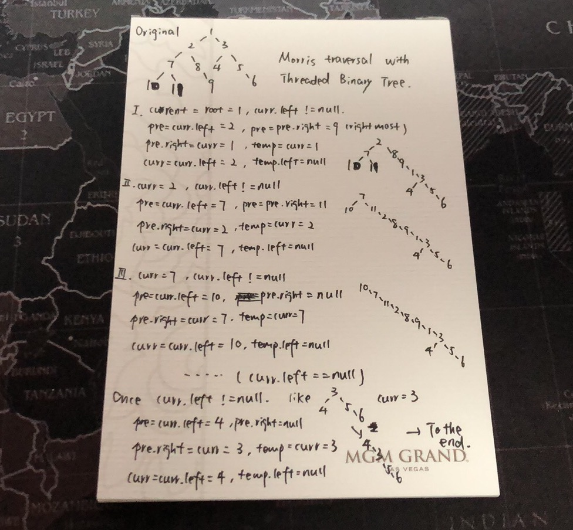

       

## Catalog  
+ [Question Description](#partI)
+ [My Thoughts](#partII)
+ [Code Exhibition](#partIII)

----------------------------------

## Question Description
Clear language for describing question.    
Given a binary tree, return the inorder traversal of its nodes' values.     

Example:     
Input: [1,null,2,3]       
---1   
----\   
-----2  
----/   
---3   
Output: [1,3,2]     

Follow up: Recursive solution is trivial, could you do it iteratively?     

----------------------------------

## My Thoughts
My thoughts for solving question after thinking and checking others' solving methods.        
Point: Binary Tree Inorder Traversal means left node, root, right node.    
[My notes](https://github.com/zhou-1/zhou-1.github.io/blob/master/_posts/JavaThinking/tree/traversal.md) on this traversal.     

Point: [Difference between recursive and iterative.](https://github.com/zhou-1/zhou-1.github.io/blob/master/_posts/JavaThinking/iterative%20and%20recursive.md)     

I. Recursive 递归，程序调用自身的编程技巧称为递归,是函数自己调用自己. 
II. Non-recursive methods. Use Iterate.      
II - 1. stack. In loop, if treenode is not null or stack is not empty, keep track of left node, push node in stack, once it is most left node, pop out, add in result list.          
II - 2. Morris traversal with Threaded Binary Tree. It is easy, actually; focus on left part first, move current node's left node to top, current node move to bottom of left node's most right node, chnage original current node's left node to be null; then root node; then same thing for right part.      
I made a process for one example below:     
  

----------------------------------

## Code Exhibition
Talk is cheap, show me the code.    
### Code in Java.     
I. Recursive for left, center and then right.    

    /**
    * Definition for a binary tree node.
    * public class TreeNode {
    *     int val;
    *     TreeNode left;
    *     TreeNode right;
    *     TreeNode(int x) { val = x; }
    * }
    */
    class Solution {
     public List<Integer> inorderTraversal(TreeNode root) {
        //prepare for result
        List<Integer> result = new ArrayList();
        
        //check for extreme condition
        if(root == null){
            return result;
        }
        else if(root.left == null && root.right == null){
            result.add(root.val);
            return result;
        }
        
        //recursive for root value and result list
        recursive(root, result);
        
        return result;
        
     }
    
     //recursive for root value
     public void recursive(TreeNode root, List<Integer> result){
        //Inorder Traversal: root.left, root, root.right
        if(root.left != null){
            recursive(root.left, result);
        }
        
        result.add(root.val);
        
        if(root.right != null){
            recursive(root.right, result);
        }
        
     }
    
    }

II - 1. Non recursive method with stack

    class Solution {
     public List<Integer> inorderTraversal(TreeNode root) {
        //prepare for result
        List<Integer> result = new ArrayList();
        
        //check for extreme condition
        if(root == null){
            return result;
        }
        else if(root.left == null && root.right == null){
            result.add(root.val);
            return result;
        }
        
        //non-recursive method
        
        //stack method
        Stack<TreeNode> stack = new Stack<> ();
        TreeNode cur = root;
        while(cur != null || !stack.isEmpty()){
            //keep track for left node
            while(cur != null){
                stack.push(cur);
                cur = cur.left;
            }
            
            cur = stack.pop();
            result.add(cur.val);
            cur = cur.right;
            
        }
        
        return result;
     }
   
    }

II - 2. Non recursive method with Morris traversal with Threaded Binary Tree

    class Solution {
     public List<Integer> inorderTraversal(TreeNode root) {
        //prepare for result
        List<Integer> result = new ArrayList();
        
        //check for extreme condition
        if(root == null){
            return result;
        }
        else if(root.left == null && root.right == null){
            result.add(root.val);
            return result;
        }
        
        //non-recursive method
        
        //Morris Traversal - Threaded Binary Tree
        TreeNode curr = root;
        TreeNode pre;
        
        while(curr != null){
            //final process
            if(curr.left == null){
                result.add(curr.val);
                curr = curr.right;//move to next right node until there is no right
            }
            
            //convert the tree to a line
            else{  //there is a left subtree/node
                pre = curr.left;
                while(pre.right != null){  //find rightmost
                    pre = pre.right;
                }
                
                pre.right = curr; //put curr after the pre node
                TreeNode temp = curr; //store curr node
                curr = curr.left;  //chnage curr to left node, move curr to the top of the new tree
                temp.left = null;  //original curr left be null, avoid infinite loops
                
            }
            
        }
        
        
        return result;
     }
   
    }

### Code in Python.   
Python code for recursive and iterative solutions    

recursive      

       # recursively
       def inorderTraversal1(self, root):
              res = []
              self.helper(root, res)
              return res
    
       def helper(self, root, res):
              if root:
                     self.helper(root.left, res)
                     res.append(root.val)
                      self.helper(root.right, res)
       
iterative      

       # iteratively       
       def inorderTraversal(self, root):
              res, stack = [], []
              while True:
                     while root:
                            stack.append(root)
                            root = root.left
              
              if not stack:
                     return res
        
              node = stack.pop()
              res.append(node.val)
              root = node.right

