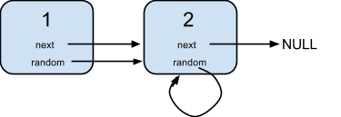

       

## Catalog  
+ [Question Description](#partI)
+ [My Thoughts](#partII)
+ [Code Exhibition](#partIII)

----------------------------------

## Question Description
Clear language for describing question.    
A linked list is given such that each node contains an additional random pointer which could point to any node in the list or null.      
Return a deep copy of the list.      

Example 1:      
      

Input:   
{"$id":"1","next":{"$id":"2","next":null,"random":{"$ref":"2"},"val":2},"random":{"$ref":"2"},"val":1}     

Explanation:   
Node 1's value is 1, both of its next and random pointer points to Node 2.   
Node 2's value is 2, its next pointer points to null and its random pointer points to itself.    
 
Note:     
You must return the copy of the given head as a reference to the cloned list.     

----------------------------------

## My Thoughts
My thoughts for solving question after thinking and checking others' solving methods.        
1. First thought is that we create a HashMap to put all nodes and node's value; then in second loop, link pointers according to relationship of the old nodes(next, random, node). Then return first node in map.    
2. Three Loops. First loop, add one copy node after current node immediately and give a value; Second loop, link copy with random value; Third loop, divide the list into head list and copyHead List which is we returned at the end.    
https://leetcode.com/problems/copy-list-with-random-pointer/discuss/43491/A-solution-with-constant-space-complexity-O(1)-and-linear-time-complexity-O(N)     

----------------------------------

## Code Exhibition
Talk is cheap, show me the code.    
### Code in Java.     
Two loop and one HashMap.   

    /*
    // Definition for a Node.
    class Node {
       public int val;
       public Node next;
       public Node random;

       public Node() {}

       public Node(int _val,Node _next,Node _random) {
          val = _val;
          next = _next;
          random = _random;
       }
     };
    */
    
    class Solution {
     public Node copyRandomList(Node head) {
        //prepare for result
        Node result = null;
        
        //check for extreme condition
        if(head == null){
            return result;
        }
        
        Node node = head;
        
        //Create a HashMap to record every node and its value
        HashMap<Node, Node> map = new HashMap<> ();  //first node for current node, second node for later use 
        while(node != null){
            // map.put(node, new Node(node.val, null, null));// it is ok.
            map.put(node, new Node(node.val));
            node = node.next;
        }
        
        //link pointers, according to relationship of the old nodes
        node = head;
        while(node != null){
            map.get(node).next = map.get(node.next);
            map.get(node).random = map.get(node.random);
            node = node.next;
        }
        
        return map.get(head);
        
     }
    }

Three loops with add copy node for random immediately after current node.   

    class Solution {
     public Node copyRandomList(Node head) {
        if(head == null){
            return head;
        }
        
        Node node = head;
        
        //head: 1 - 2 - 3 - 4
        
        //First loop, add copy after node directly
        while(node != null){
            Node next = node.next; //so in the example, in first loop, next now is 2
            node.next = new Node(node.val); //in first loop, node.next now is 1'
            node.next.next = next; //so in first loop, it is 1 - 1' - 2now
            node = next; //in first loop, for next node, 2
        }
        
        //After loop, it is currently, 1 - 1' - 2 - 2' - 3 - 3' - 4 - 4'
        
        //Second loop, link random for copyhead
        node = head;
        while(node != null){
            if(node.random != null){
                node.next.random = node.random.next; //in first loop, it will be 1' = 3'
            }
            node = node.next.next; //in first loop, it will be 2
        }
        
        //Third loop, divide into head and copyhead
        node = head;
        Node copyHead = node.next;  //it is 1' initially
        Node copy = copyHead; //it is 1' initially
        while(copy.next != null){
            //first copy.next is 2
            node.next = node.next.next; //In first loop, node.next now is 2
            node = node.next; //In first loop, node now is 2
            
            copy.next = copy.next.next; //In first loop, copy.next is 2'
            copy = copy.next; //In first loop, copy is 2'
            
        }
        //Last step
        node.next = node.next.next; 
        
        return copyHead;
     }
    }

### Code in Python.   
Similar to first solution in Java    

       class Solution:
       # @param head, a RandomListNode
       # @return a RandomListNode
       def copyRandomList(self, head):
          dic = dict()
          m = n = head
          while m:
              dic[m] = RandomListNode(m.label)
              m = m.next
          while n:
              dic[n].next = dic.get(n.next)
              dic[n].random = dic.get(n.random)
              n = n.next
        return dic.get(head)

O(n) time    

       class Solution:
       # @param head, a RandomListNode
       # @return a RandomListNode
       def copyRandomList(self, head):
          dic = collections.defaultdict(lambda: RandomListNode(0))
          dic[None] = None
          n = head
          while n:
              dic[n].label = n.label
              dic[n].next = dic[n.next]
              dic[n].random = dic[n.random]
              n = n.next
       return dic[head]

