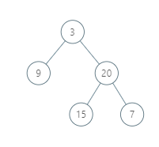

       

## Catalog  
+ [Question Description](#partI)
+ [My Thoughts](#partII)
+ [Code Exhibition](#partIII)

----------------------------------

## Question Description
Clear language for describing question.    

Given a binary tree, return the vertical order traversal of its nodes values.     
For each node at position (X, Y), its left and right children respectively will be at positions (X-1, Y-1) and (X+1, Y-1).     
Running a vertical line from X = -infinity to X = +infinity, whenever the vertical line touches some nodes, we report the values of the nodes in order from top to bottom (decreasing Y coordinates).     
If two nodes have the same position, then the value of the node that is reported first is the value that is smaller.     
Return an list of non-empty reports in order of X coordinate.  Every report will have a list of values of nodes.      

Example 1:      
           
Input: [3,9,20,null,null,15,7]   
Output: [[9],[3,15],[20],[7]]   
Explanation:     
Without loss of generality, we can assume the root node is at position (0, 0):   
Then, the node with value 9 occurs at position (-1, -1);    
The nodes with values 3 and 15 occur at positions (0, 0) and (0, -2);    
The node with value 20 occurs at position (1, -1);   
The node with value 7 occurs at position (2, -2).         

Example 2:     
     
Input: [1,2,3,4,5,6,7]    
Output: [[4],[2],[1,5,6],[3],[7]]    
Explanation:     
The node with value 5 and the node with value 6 have the same position according to the given scheme.    
However, in the report "[1,5,6]", the node value of 5 comes first since 5 is smaller than 6.    

Note:    
The tree will have between 1 and 1000 nodes.    
Each node's value will be between 0 and 1000.     

----------------------------------

## My Thoughts
My thoughts for solving question after thinking and checking others' solving methods.        

I. Location class and DFS     
Intuition      
It's evident that there are two steps in a straightforward solution: first, find the location of every node, then report their locations.        
Algorithm       
To find the location of every node, we can use a depth-first search. During the search, we will maintain the location (x, y) of the node. As we move from parent to child, the location changes to (x-1, y+1) or (x+1, y+1) depending on if it is a left child or right child. [We use y+1 to make our sorting by decreasing y easier.]      
To report the locations, we sort them by x coordinate, then y coordinate, so that they are in the correct order to be added to our answer.        

II. TreeMap and PriorityQueue      

----------------------------------

## Code Exhibition
Talk is cheap, show me the code.    
### Code in Java.     
Store locations, DFS and location class    

       /**
       * Definition for a binary tree node.
        * public class TreeNode {
       *     int val;
       *     TreeNode left;
       *     TreeNode right;
        *     TreeNode(int x) { val = x; }
       * }
       */

    class Solution {
      List<Location> locations;
    
      public List<List<Integer>> verticalTraversal(TreeNode root) {
        //Each location is a node's x, y position and value
        locations = new ArrayList();
        
        dfs(root, 0, 0);
        Collections.sort(locations);
        
        List<List<Integer>> ans = new ArrayList<> ();
        ans.add(new ArrayList<Integer>() );
        
        int prev = locations.get(0).x;
        
        for(Location loc : locations){
            //if the x value changed, it is part of a new report
            if(loc.x != prev){
                prev = loc.x;
                ans.add(new ArrayList<Integer>() );
            }
            
            //we always add the node's value to the latest report
            ans.get(ans.size() - 1).add(loc.val);
        }
        
        return ans;
      }
    
      public void dfs(TreeNode node, int x, int y) {
        if (node != null) {
            locations.add(new Location(x, y, node.val));
            dfs(node.left, x-1, y+1);
            dfs(node.right, x+1, y+1);
        }
      }
    
    }

    class Location implements Comparable<Location>{
      int x, y, val;
      Location(int x, int y, int val){
        this.x = x;
        this.y = y;
        this.val = val;
      }
    
      @Override
      public int compareTo(Location that){
        if(this.x != that.x){
            return Integer.compare(this.x, that.x);
        }
        else if(this.y != that.y){
            return Integer.compare(this.y, that.y);
        }        
        else{
            return Integer.compare(this.val, that.val);
        }
      }
    
    }

TreeMap and PriorityQueue      

    class Solution {
      public List<List<Integer>> verticalTraversal(TreeNode root) {
        TreeMap<Integer, TreeMap<Integer, PriorityQueue<Integer>>> map = new TreeMap<>();
        dfs(root, 0, 0, map);
        
        List<List<Integer>> list = new ArrayList<>();
        
        for (TreeMap<Integer, PriorityQueue<Integer>> ys : map.values()) {
            list.add(new ArrayList<>());
            for (PriorityQueue<Integer> nodes : ys.values()) {
                while (!nodes.isEmpty()) {
                    list.get(list.size() - 1).add(nodes.poll());
                }
            }
        }
        
        return list;
        
       }
    
       private void dfs(TreeNode root, int x, int y, TreeMap<Integer, TreeMap<Integer, PriorityQueue<Integer>>> map) {
        if (root == null) {
            return;
        }
        if (!map.containsKey(x)) {
            map.put(x, new TreeMap<>());
        }
        if (!map.get(x).containsKey(y)) {
            map.get(x).put(y, new PriorityQueue<>());
        }
         
        map.get(x).get(y).offer(root.val);
        dfs(root.left, x - 1, y + 1, map);
        dfs(root.right, x + 1, y + 1, map);
      }
    
    }

### Code in Python.   

